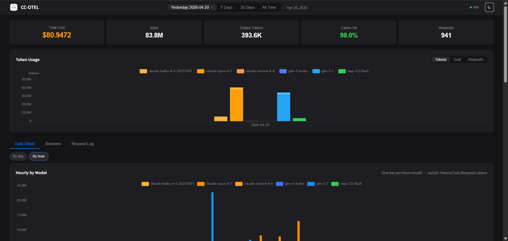
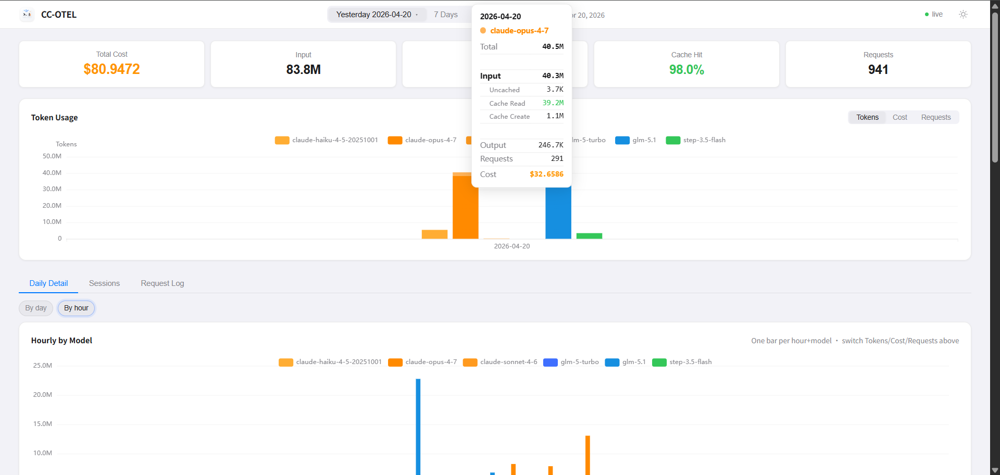

[Chinese Documentation](./README.md)

[](https://github.com/young1lin/cc-otel)
[](https://golang.org/)
[](LICENSE)
[](https://github.com/young1lin/cc-otel/releases)
[](https://codecov.io/gh/young1lin/cc-otel)
[](https://goreportcard.com/report/github.com/young1lin/cc-otel)
[](https://github.com/young1lin/cc-otel/actions/workflows/test.yml)
[](https://github.com/young1lin/cc-otel/releases)
[](https://github.com/young1lin/cc-otel/releases)

# CC-OTEL

Self-hosted OTLP gRPC receiver + Web dashboard for **Claude Code** token usage and cost.

## Docs

- [Design notes (why / how to change safely)](./docs/DESIGN_EN.md)
- [Changelog (unreleased / version changes)](./CHANGELOG_EN.md)
- [Claude Code OTEL event reference](./docs/otel-events.md)

**Dark**


**Light**


## Why

Claude Code has built-in OpenTelemetry support, but viewing the data requires setting up Grafana, Prometheus, or a third-party SaaS. **CC-OTEL** is a single binary that receives OTLP telemetry, stores it in SQLite, and serves a web dashboard -- no external dependencies, no complex setup.

## Architecture

```
Claude Code ──OTLP gRPC(:4317)──> cc-otel ──> SQLite
                                      |
                                  Web UI <── Browser (localhost:8899)
```

## Features

- **OTLP gRPC receiver** -- receives Claude Code metrics and log events
- **Web dashboard** -- token usage, cost breakdown, cache hit rate, per-model stats
- **KPI breakdowns** -- click any KPI card for model-level detail
- **Live updates** -- SSE push when new data arrives
- **Dark / light theme** -- auto-detects system preference
- **Date ranges** -- Today, 7 Days, 30 Days, All Time, or custom date picker
- **Chart switching** -- Tokens, Cost, Requests views
- **Session tracking** -- per-session cost and token aggregation
- **Token rate chart (Rate)** -- per-model Out/Total tok/s over time (weighted / average, 5–60 min buckets; up to 7 days)
- **Pre-aggregation table** -- query latency < 3ms, handles millions of rows
- **Single binary** -- `go:embed` bundles the web UI, zero runtime dependencies
- **Cross-platform** -- Windows, macOS, Linux

## Install

### Claude Code Plugin (recommended)

```bash
/plugin marketplace add young1lin/claude-token-monitor
/plugin install cc-otel@claude-token-monitor
/reload-plugins
/cc-otel:setup
```

### Available Commands

| Command | Description |
|---------|-------------|
| `/cc-otel:setup` | Download binary, configure OTEL env vars, start service |
| `/cc-otel:start` | Start background daemon |
| `/cc-otel:stop` | Stop daemon |
| `/cc-otel:status` | Show service status + today's cost summary |
| `/cc-otel:open` | Open Web dashboard in browser |
| `/cc-otel:report [today\|7d\|30d\|all]` | Generate cost report |

### From Source

```bash
# Linux / macOS
go build -o cc-otel ./cmd/cc-otel/

# Windows
go build -o cc-otel.exe ./cmd/cc-otel/
```

### From Release

Download the binary for your platform from [Releases](https://github.com/young1lin/cc-otel/releases).

### Install to ~/.claude/cc-otel/

```bash
cc-otel install    # copies binary to ~/.claude/cc-otel/ (all platforms)
cc-otel init       # generates default config in the same directory
```

## Run

```bash
cc-otel start      # background daemon
cc-otel status     # show version, PID, ports, today's stats
cc-otel stop       # stop daemon
cc-otel serve      # foreground (debugging)
cc-otel -v         # print version
cc-otel cleanup    # delete old data per retention_days
```

Open the dashboard: **http://localhost:8899/**

## How It Works

### What is OpenTelemetry?

[OpenTelemetry](https://opentelemetry.io/) (OTEL) is the CNCF observability standard that unifies three telemetry signals:

- **Metrics** -- time-series counters (tokens, cost, request count, ...)
- **Logs / Events** -- structured events (every API request, user prompt, tool result)
- **Traces** -- distributed tracing (beta in Claude Code 0.2.x+)

Claude Code ships an embedded OTEL SDK and exports these signals over **OTLP** (OpenTelemetry Protocol) to any compatible backend. CC-OTEL is a lightweight OTLP backend purpose-built for Claude Code.

### Data Flow

```
┌─────────────────┐    OTLP/gRPC     ┌──────────────────────┐    ┌────────────────────────┐
│  Claude Code    │ ───────────────▶ │  cc-otel (:4317)     │───▶│  SQLite                │
│  Codex CLI      │    :4317         │  · LogsService       │    │  · api_requests        │
│  (OTEL SDK)     │                  │  · MetricsService    │    │  · codex_api_requests  │
│  logs + traces  │                  │  · TraceService      │    │  · daily_model_agg     │
└─────────────────┘                  └──────────┬───────────┘    │  · codex_daily_model…  │
                                                │ Notify()       └──────────┬─────────────┘
                                                ▼                           │
                                     ┌──────────────────────┐               │
                                     │  Web UI (:8899)      │◀──────────────┘
                                     │  · REST API          │   query
                                     │  · SSE /api/events   │───┐
                                     └──────────────────────┘   │ push
                                                                ▼
                                                         ┌────────────┐
                                                         │  Browser   │
                                                         └────────────┘
```

### Three Stages

**1. Receive (`internal/receiver/`)**

An embedded gRPC server implementing the official OTLP `LogsService`, `MetricsService`, and `TraceService`:

- Each `claude_code.api_request` log event carries the full detail of one API call (model, tokens, cost, duration, `session.id`, `user.id`, etc. as resource + record attributes) and is written to the `api_requests` table.
- `claude_code.token.usage`, `claude_code.cost.usage` and other metrics are intentionally **not persisted** (redundant with the `api_request` log); the gRPC call is still accepted so clients don't error out.
- Trace spans are mined for `ttft_ms` and back-filled into the matching `api_requests` / `codex_api_requests` rows.
- The `raw_otlp_events` / `codex_raw_otlp_events` tables remain in the schema for compatibility with existing backfill tools but **no new rows are written**.

**2. Store (`internal/db/`)**

A single-file SQLite database (WAL mode + `busy_timeout`):

- `api_requests` / `codex_api_requests` -- one row per API call, the finest-grained fact table.
- `daily_model_agg` / `codex_daily_model_agg` -- pre-aggregated on the insert path by (date × model); all chart / Daily Detail queries hit these tables (latency < 3 ms).
- `raw_otlp_events` / `codex_raw_otlp_events` -- legacy raw-event tables (now write-frozen) + background sweepers: `raw_ttl_days` (default 5d) prunes raw tables hourly; the rest of the detail tables are governed by `retention_days` (default 90d).

Token accounting follows Anthropic's [Prompt caching spec](https://docs.anthropic.com/en/docs/build-with-claude/prompt-caching) precisely: total input side = `input_tokens` + `cache_read_tokens` + `cache_creation_tokens`, surfaced in the UI as three columns (Uncached / Cache Read / Cache Create).

**3. Serve (`internal/api/` + `internal/web/`)**

- REST API: `/api/dashboard`, `/api/daily`, `/api/sessions`, `/api/rate`, `/api/session/rate`, `/api/status`, ...
- SSE: `/api/events` -- every successful insert calls `Broker.Notify()`, which pushes a Server-Sent Event to the browser so charts refresh without polling
- Static assets: bundled with `go:embed` by default; set `CC_OTEL_STATIC_DIR` during local development to serve directly from disk and skip recompilation

### Why gRPC and not HTTP?

Claude Code supports `grpc`, `http/json`, and `http/protobuf` for OTLP. CC-OTEL implements only gRPC because:

- Claude Code's gRPC exporter path is the most battle-tested
- The protobuf wire format is ~40% smaller than JSON -- meaningful for high-frequency writes and long sessions
- HTTP/2 multiplexing keeps export latency low under connection reuse

If your environment requires HTTP, put an `otel-collector` between Claude Code and cc-otel to convert protocols.

## Configure Claude Code

Claude Code must export OTLP via gRPC to CC-OTEL. Add these env vars to `~/.claude/settings.json` under `"env"`:

```json
{
  "env": {
    "CLAUDE_CODE_ENABLE_TELEMETRY": "1",
    "OTEL_EXPORTER_OTLP_PROTOCOL": "grpc",
    "OTEL_EXPORTER_OTLP_ENDPOINT": "http://localhost:4317",
    "OTEL_METRICS_EXPORTER": "otlp",
    "OTEL_LOGS_EXPORTER": "otlp",
    "no_proxy": "localhost,127.0.0.1"
  }
}
```

> **Important**: only add/update the OTEL keys -- do not overwrite your existing settings. The port should match `otel_port` in `cc-otel.yaml`.

> **⚠️ Proxy users — required**: If you have `http_proxy` / `https_proxy` set (e.g. Clash, V2Ray, or corporate proxies), you **must** also set `no_proxy` to exclude localhost, **otherwise telemetry data will not be received at all**. The OTEL gRPC SDK routes traffic to `localhost:4317` through the proxy, which silently drops the gRPC connection — cc-otel receives nothing. Setting `"no_proxy": "localhost,127.0.0.1"` forces the OTEL exporter to connect directly. `/cc-otel:setup` adds this automatically.

### Codex CLI Setup

cc-otel also supports receiving OpenTelemetry telemetry from OpenAI Codex CLI. Codex shares the same OTLP gRPC port (`:4317`) with Claude Code. cc-otel auto-detects the source via the OTLP Resource `service.name` attribute and routes data to separate `codex_*` tables.

Add to `~/.codex/config.toml` (backup first, then append — do not overwrite existing config):

```toml
[otel]
environment = "dev"
exporter.otlp-grpc.endpoint = "http://localhost:4317"
trace-exporter.otlp-grpc.endpoint = "http://localhost:4317"
metrics-exporter.otlp-grpc.endpoint = "http://localhost:4317"
```

Start Codex and use normally. Open the dashboard (`http://localhost:8899/?source=codex`) to view Codex usage data. **Codex does not report `cost_usd`** — cc-otel computes it locally from the per-token price table and writes the result into `codex_api_requests.cost_usd`, so the Cost KPI matches the Claude tab.

## Pricing table & non-Claude cost recompute

cc-otel ships with a price snapshot derived from [BerriAI/litellm](https://github.com/BerriAI/litellm) (GPT / GLM / DeepSeek / Kimi / Qwen / …). The first start seeds it into the `model_pricing` table. **The price table is purely manual now — there is no scheduled remote refresh.** Lookups follow this priority:

1. **`pricing:` in `cc-otel.yaml`** (user override, highest)
2. **SQLite `model_pricing` table** (canonical store, survives restarts)

To change a price: open the Web UI (top-right `live` → Status popup → **Pricing Table**) and add/edit/delete rows directly — saves take effect immediately. Click the in-row 💡 to look up a single model on OpenRouter on demand and prefill its prices. After a price change, click ↻ 重算历史 to trigger a server-side full recompute (status tracked, survives page refresh).

Recompute follows a single rule:

- `model` starts with `claude-` (case-insensitive) → trust the `cost_usd` Claude Code already reported (Anthropic owns the canonical Claude prices).
- Everything else → recompute locally from token counts.

This corrects two situations: Codex (`gpt-5-codex`, etc.) records that previously stored `cost_usd = 0`, and GLM/DeepSeek/Kimi traffic that flowed through an Anthropic-compatible reverse proxy and was therefore priced like Sonnet/Opus.

Debug: `GET /api/pricing/lookup?model=glm-4.6` shows the resolved entry and match strategy. The Status popup's **Pricing Table** row shows the last recompute result.

Backfilling history:

```bash
# dry-run first
go run ./tools/recompute_cost --db ~/.claude/cc-otel/cc-otel.db --table both
# review the per-model delta, then apply
go run ./tools/recompute_cost --db ~/.claude/cc-otel/cc-otel.db --table both --apply
```

## Configuration

CC-OTEL resolves its data directory in this order (see `defaultDataDir` in `internal/config/config.go`):

1. **`./bin/`** -- if the executable lives in a directory named `bin` (dev mode).
2. **`~/.claude/cc-otel/`** -- otherwise this directory is used (auto-created if missing).
3. **`.`** -- final fallback, used only when the home directory can't be resolved.

> Note: `~/.claude/` itself is **not** an intermediate lookup step. Older docs implied it was, but the code never inspects `~/.claude/` without the `cc-otel/` suffix.

All files (binary, config, DB, PID, log) live in the same directory:

```
~/.claude/cc-otel/
├── cc-otel(.exe)    # executable
├── cc-otel.yaml     # config
├── cc-otel.db       # SQLite database
├── cc-otel.pid      # daemon PID
└── cc-otel.log      # log file
```

Environment variable overrides (highest priority):

| Variable | Description | Default |
|----------|-------------|---------|
| `CC_OTEL_OTEL_PORT` | OTLP gRPC receiver port | `4317` |
| `CC_OTEL_WEB_PORT` | Web UI port | `8899` |
| `CC_OTEL_DB_PATH` | SQLite database path | `~/.claude/cc-otel/cc-otel.db` |

### Data Retention

cc-otel runs two independent cleanups:

```yaml
retention_days: 90    # cap on full-detail tables (api_requests / events / *_events / *_agg etc.) in days; 0 = keep forever
raw_ttl_days: 5       # cap on raw_otlp_events / codex_raw_otlp_events in days (now write-frozen, this just trims old rows); 0 = keep forever
```

- `retention_days` (default 90) is consumed by `cc-otel cleanup` and the periodic prune.
- `raw_ttl_days` (default 5) is consumed by a separate hourly sweeper, because the raw tables dominate disk usage.

## Web UI


### Status Indicator

Top-right green dot + `live` indicates the SSE stream is connected. Click to open the **Server Status** panel showing DB health, OTLP receiver status, and endpoints.

### KPI Breakdowns

Click any KPI card (Cost, Input, Output, Cache Hit, Requests) to see a per-model breakdown.

### Panels

| Panel | Description |
|-------|-------------|
| **Daily Detail** | Per-day / per-hour tables; Intraday line chart on single-day ranges |
| **Sessions** | Per-session Cost / Token aggregates |
| **Request Log** | Per-model duration and **Out tok/s (avg / weighted)** summary; per-request list with TTFT |
| **Rate** | Per-model **Token Rate over Time** line chart; Weighted / Avg, Output / Total tok/s, 5 / 15 / 30 / 60 min buckets; click legend to solo one model (**All models** to restore) |

`duration_ms` is API request time only (excludes local tool execution), so tok/s reflects model output throughput. Multi-day views break lines at calendar-day boundaries; switching the date range defaults to **Today → 5 min**, **multi-day → 30 min** (overridable).

## Update

### Update Plugin (commands and skills)

```bash
/plugin update cc-otel@claude-token-monitor
```

### Update Binary

`/cc-otel:setup` checks the installed version against the latest GitHub release and auto-updates if needed.

Or manually:

```bash
# Check current version
~/.claude/cc-otel/cc-otel -v

# Force re-install
/cc-otel:setup --force
```

## Development

```bash
make build       # build with version injection
make test        # run all tests
make coverage    # generate coverage report
make vet         # go vet
```

For frontend development without rebuilding:

```bash
CC_OTEL_STATIC_DIR=internal/web/static cc-otel serve
```

## License

[MIT](LICENSE)
